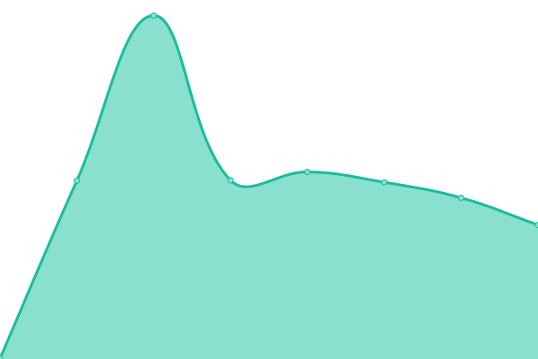

# [📈 Live Status](https://katana-network.github.io/status): <!--live status--> **🟩 All systems operational**

This repository contains the open-source uptime monitor and status page for [Katana Network](https://katana-network.github.io/status), powered by [Upptime](https://github.com/upptime/upptime).

With [Upptime](https://upptime.js.org), you can get your own unlimited and free uptime monitor and status page, powered entirely by a GitHub repository. We use [Issues](https://github.com/katana-network/status/issues) as incident reports, [Actions](https://github.com/katana-network/status/actions) as uptime monitors, and [Pages](https://katana-network.github.io/status) for the status page.

<!--start: status pages-->
<!-- This summary is generated by Upptime (https://github.com/upptime/upptime) -->
<!-- Do not edit this manually, your changes will be overwritten -->
<!-- prettier-ignore -->
| URL | Status | History | Response Time | Uptime |
| --- | ------ | ------- | ------------- | ------ |
|  [katana website](https://katana.network) | 🟩 Up | [katana-website.yml](https://github.com/katana-network/status/commits/HEAD/history/katana-website.yml) | 

 350ms
     
 | 

<a href="https://status.katana.network/history/katana-website">100.00%</a>
    

|  [katana app](https://app.katana.network) | 🟩 Up | [katana-app.yml](https://github.com/katana-network/status/commits/HEAD/history/katana-app.yml) | 

 231ms
     
 | 

<a href="https://status.katana.network/history/katana-app">100.00%</a>
    

|  [katana api](https://api.katana.network/health) | 🟩 Up | [katana-api.yml](https://github.com/katana-network/status/commits/HEAD/history/katana-api.yml) | 

 349ms
     
 | 

<a href="https://status.katana.network/history/katana-api">100.00%</a>
    

|  [katana questing api](https://questing-api.katana.network/health) | 🟩 Up | [katana-questing-api.yml](https://github.com/katana-network/status/commits/HEAD/history/katana-questing-api.yml) | 

 396ms
     
 | 

<a href="https://status.katana.network/history/katana-questing-api">100.00%</a>
    

|  [vault rewards api](https://vault-rewards-api.katana.network/api/v1/health) | 🟩 Up | [vault-rewards-api.yml](https://github.com/katana-network/status/commits/HEAD/history/vault-rewards-api.yml) | 

 357ms
     
 | 

<a href="https://status.katana.network/history/vault-rewards-api">100.00%</a>
    

|  [public rpc](https://rpc.katana.network) | 🟩 Up | [public-rpc.yml](https://github.com/katana-network/status/commits/HEAD/history/public-rpc.yml) | 

 449ms
     
 | 

<a href="https://status.katana.network/history/public-rpc">100.00%</a>
    

|  [zerion](https://api.zerion.io/health) | 🟩 Up | [zerion.yml](https://github.com/katana-network/status/commits/HEAD/history/zerion.yml) | 

 233ms
     
 | 

<a href="https://status.katana.network/history/zerion">100.00%</a>
    

|  [balance api](https://balance-api-gcp.polygon.technology/health-check) | 🟩 Up | [balance-api.yml](https://github.com/katana-network/status/commits/HEAD/history/balance-api.yml) | 

 927ms
     
 | 

<a href="https://status.katana.network/history/balance-api">100.00%</a>
    

|  [yearn api](https://kong.yearn.farm/api/gql) | 🟩 Up | [yearn-api.yml](https://github.com/katana-network/status/commits/HEAD/history/yearn-api.yml) | 

 0ms
     
 | 

<a href="https://status.katana.network/history/yearn-api">100.00%</a>
    

|  [morpho api](https://blue-api.morpho.org/graphql) | 🟩 Up | [morpho-api.yml](https://github.com/katana-network/status/commits/HEAD/history/morpho-api.yml) | 

 0ms
     
 | 

<a href="https://status.katana.network/history/morpho-api">100.00%</a>
    

|  [sushiswap api](https://api.sushi.com/price/v1/747474) | 🟩 Up | [sushiswap-api.yml](https://github.com/katana-network/status/commits/HEAD/history/sushiswap-api.yml) | 

 0ms
     
 | 

<a href="https://status.katana.network/history/sushiswap-api">0.45%</a>
    

|  [charm finance api](https://stitching-katana-92e4c8313e0e.herokuapp.com/747474) | 🟩 Up | [charm-finance-api.yml](https://github.com/katana-network/status/commits/HEAD/history/charm-finance-api.yml) | 

 0ms
     
 | 

<a href="https://status.katana.network/history/charm-finance-api">100.00%</a>
    

|  [coingecko api](https://api.coingecko.com/api/v3/ping) | 🟩 Up | [coingecko-api.yml](https://github.com/katana-network/status/commits/HEAD/history/coingecko-api.yml) | 

 0ms
     
 | 

<a href="https://status.katana.network/history/coingecko-api">100.00%</a>
    

|  [merkl api](https://api.merkl.xyz/v4/tokens/reward/747474) | 🟩 Up | [merkl-api.yml](https://github.com/katana-network/status/commits/HEAD/history/merkl-api.yml) | 

 0ms
     
 | 

<a href="https://status.katana.network/history/merkl-api">100.00%</a>
    

|  [trails (sequence)](https://trails-api.sequence.app/rpc/Trails/GetIntent) | 🟩 Up | [trails-sequence.yml](https://github.com/katana-network/status/commits/HEAD/history/trails-sequence.yml) | 

 0ms
     
 | 

<a href="https://status.katana.network/history/trails-sequence">100.00%</a>
    

|  [configcat cdn](https://cdn-global.configcat.com) | 🟩 Up | [configcat-cdn.yml](https://github.com/katana-network/status/commits/HEAD/history/configcat-cdn.yml) | 

 0ms
     
 | 

<a href="https://status.katana.network/history/configcat-cdn">100.00%</a>
    

|  [katana rpc - chain id](https://rpc.katana.network) | 🟩 Up | [katana-rpc-chain-id.yml](https://github.com/katana-network/status/commits/HEAD/history/katana-rpc-chain-id.yml) | 

 0ms
     
 | 

<a href="https://status.katana.network/history/katana-rpc-chain-id">0.41%</a>
    

|  [katana rpc - block number](https://rpc.katana.network) | 🟩 Up | [katana-rpc-block-number.yml](https://github.com/katana-network/status/commits/HEAD/history/katana-rpc-block-number.yml) | 

 0ms
     
 | 

<a href="https://status.katana.network/history/katana-rpc-block-number">100.00%</a>
    

|  conduit katana rpc | 🟩 Up | [conduit-katana-rpc.yml](https://github.com/katana-network/status/commits/HEAD/history/conduit-katana-rpc.yml) | 

 0ms
     
 | 

<a href="https://status.katana.network/history/conduit-katana-rpc">0.00%</a>
    

|  [katanascan explorer](https://katanascan.com) | 🟩 Up | [katanascan-explorer.yml](https://github.com/katana-network/status/commits/HEAD/history/katanascan-explorer.yml) | 

 0ms
     
 | 

<a href="https://status.katana.network/history/katanascan-explorer">100.00%</a>
    

<!--end: status pages-->

[**Visit our status website →**](https://katana-network.github.io/status)

## 📄 License

- Powered by: [Upptime](https://github.com/upptime/upptime)
- Code: [MIT](./LICENSE) © [Anand Chowdhary](https://anandchowdhary.com), supported by [Pabio](https://pabio.com)
- Data in the `./history` directory: [Open Database License](https://opendatacommons.org/licenses/odbl/1-0/)
